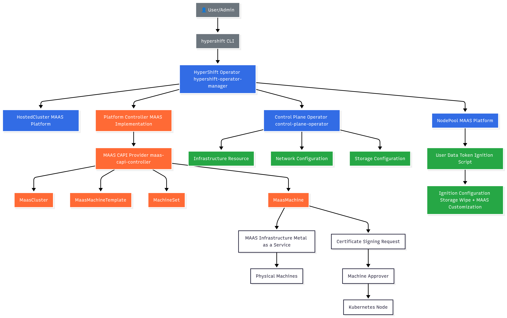
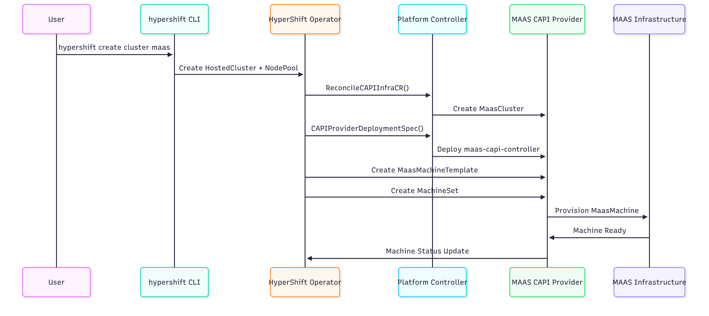
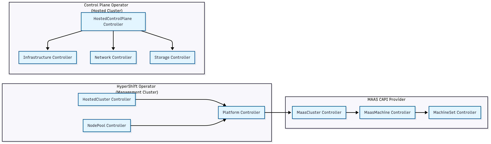

# MAAS Platform Architecture in HyperShift

## 🏗️ High-Level Architecture Overview



## 🔄 Detailed Resource Flow & Controllers

### 1. **Resource Creation Flow**



### 2. **Controller Reconciliation Loops**



## 📋 Resource Definitions & Relationships

### **Core HyperShift Resources**

```yaml
# HostedCluster with MAAS Platform
apiVersion: hypershift.openshift.io/v1beta1
kind: HostedCluster
metadata:
  name: maas-cluster
spec:
  platform:
    type: MAAS
    maas:
      endpoint: "https://maas.example.com"
      apiKey: "your-api-key"
      zone: "zone1"
      dnsDomain: "maas.local"
---
# NodePool with MAAS Configuration
apiVersion: hypershift.openshift.io/v1beta1
kind: NodePool
metadata:
  name: maas-workers
spec:
  platform:
    type: MAAS
    maas:
      machineType: "compute"
      zone: "zone1"
      image: "ubuntu/focal"
      minCpu: 2
      minMemory: 4096
      tags: ["worker", "compute"]
      failureDomain: "rack1"
```

### **Generated CAPI Resources**

```yaml
# MaasCluster (Generated by Platform Controller)
apiVersion: infrastructure.cluster.x-k8s.io/v1beta1
kind: MaasCluster
metadata:
  name: maas-cluster
  namespace: clusters-maas-cluster
spec:
  dnsDomain: "maas.local"
  controlPlaneEndpoint:
    host: "10.0.0.10"
    port: 6443
---
# MaasMachineTemplate (Generated by NodePool Controller)
apiVersion: infrastructure.cluster.x-k8s.io/v1beta1
kind: MaasMachineTemplate
metadata:
  name: maas-workers-template-abc123
spec:
  template:
    spec:
      image: "ubuntu/focal"
      minCpu: 2
      minMemoryInMB: 4096
      tags: ["worker", "compute"]
      resourcePool: "default"
      failureDomain: "rack1"
---
# MachineSet (Generated by NodePool Controller)
apiVersion: cluster.x-k8s.io/v1beta1
kind: MachineSet
metadata:
  name: maas-workers-abc123
spec:
  replicas: 3
  selector:
    matchLabels:
      cluster.x-k8s.io/cluster-name: maas-cluster
  template:
    spec:
      clusterName: maas-cluster
      infrastructureRef:
        apiVersion: infrastructure.cluster.x-k8s.io/v1beta1
        kind: MaasMachineTemplate
        name: maas-workers-template-abc123
```

## 🎯 Controller Responsibilities

### **1. HyperShift Operator Controllers**

| Controller | Responsibility | MAAS-Specific Logic |
|------------|----------------|---------------------|
| **HostedCluster Controller** | Manages HostedCluster lifecycle | Creates MaasCluster via Platform Controller |
| **NodePool Controller** | Manages NodePool lifecycle | Creates MaasMachineTemplate & MachineSet |
| **Platform Controller** | Platform-specific infrastructure | MAAS CAPI provider deployment & MaasCluster creation |

### **2. Control Plane Operator Controllers**

| Controller | Responsibility | MAAS-Specific Logic |
|------------|----------------|---------------------|
| **Infrastructure Controller** | OpenShift Infrastructure resource | Sets platform type to "None" for MAAS compatibility |
| **Network Controller** | Network configuration | MAAS-specific network policies |
| **Storage Controller** | Storage configuration | MAAS-specific storage policies |

### **3. MAAS CAPI Provider Controllers**

| Controller | Responsibility | Function |
|------------|----------------|----------|
| **MaasCluster Controller** | Manages MAAS cluster lifecycle | Provisions MAAS infrastructure |
| **MaasMachine Controller** | Manages individual MAAS machines | Provisions physical machines via MAAS API |
| **MachineSet Controller** | Manages machine scaling | Ensures desired number of machines |

## 🔧 Key Integration Points

### **1. Platform Factory Pattern**
```go
// hypershift-operator/controllers/hostedcluster/internal/platform/platform.go
func GetPlatform(platformType hyperv1.PlatformType, ...) (Platform, error) {
    switch platformType {
    case hyperv1.MAASPlatform:
        return maas.New(capiProviderImage), nil
    // ... other platforms
    }
}
```

### **2. Machine Template Builder**
```go
// hypershift-operator/controllers/nodepool/capi.go
switch nodePool.Spec.Platform.Type {
case hyperv1.MAASPlatform:
    template = &capimaas.MaasMachineTemplate{}
    machineTemplateSpec, err = maas.MachineTemplateSpec(nodePool)
    // ... template creation logic
}
```

### **3. Ignition Customization**
```go
// hypershift-operator/controllers/nodepool/token.go
if nodePool.Spec.Platform.Type == hyperv1.MAASPlatform {
    cfg.Storage = ignitionapi.Storage{
        Disks: []ignitionapi.Disk{
            {
                Device: "/dev/sda",
                Partitions: []ignitionapi.Partition{
                    {
                        Number: 5,
                        ShouldExist: ptr.To(false),
                        WipePartitionEntry: ptr.To(true),
                    },
                },
            },
        },
    }
}
```

## 🚀 Deployment Flow

### **1. Initial Installation**
```bash
# Install HyperShift with custom operator image
hypershift install \
  --hypershift-image us-east1-docker.pkg.dev/spectro-images/dev/guyni/hypershift-operator:latest \
  --namespace hypershift
```

### **2. Cluster Creation**
```bash
# Create MAAS cluster
hypershift create cluster maas \
  --name maas-cluster \
  --endpoint https://maas.example.com \
  --api-key your-api-key \
  --zone zone1
```

### **3. NodePool Creation**
```bash
# Create MAAS NodePool
hypershift create nodepool maas \
  --name maas-workers \
  --cluster-name maas-cluster \
  --machine-type compute \
  --replicas 3
```

## 🔍 Monitoring & Debugging

### **Key Resources to Monitor**
- `HostedCluster` status and conditions
- `NodePool` status and conditions  
- `MaasCluster` status
- `MaasMachine` status and events
- `MachineSet` status and scaling
- MAAS CAPI provider pod logs

### **Common Issues & Solutions**
1. **Infrastructure Resource Issues**: Platform type set to "None" for OpenShift compatibility
2. **Machine Approval Issues**: Manual CSR approval may be required
3. **Image Compatibility**: Ensure single-platform images for container runtime compatibility

## 📚 Related Documentation
- [MAAS Support Instructions](./MAAS_SUPPORT_INSTRUCTIONS.md)
- [HyperShift API Reference](https://hypershift-docs.openshift.io/reference/api/)
- [Cluster API MAAS Provider](https://github.com/spectrocloud/cluster-api-provider-maas)
